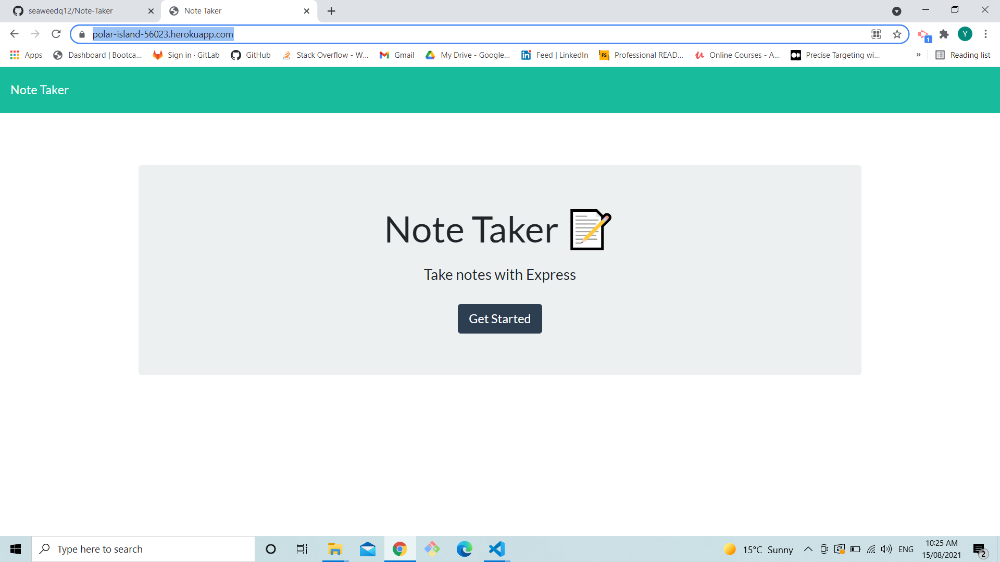
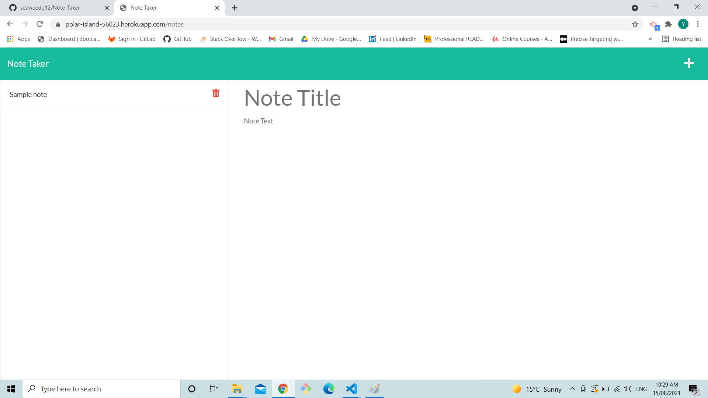
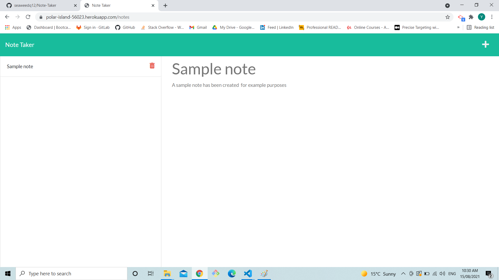
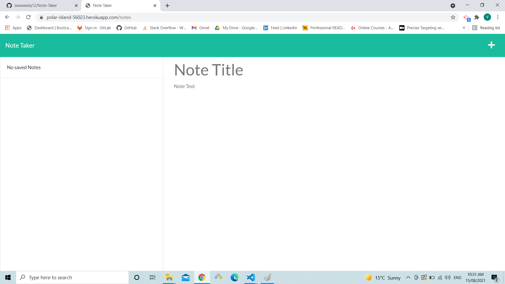

# 11 Express.js: Note Taker

## Your Task

In this weeks task a note taking app had to be edited and be deloyed to heroku.

## URL

https://polar-island-56023.herokuapp.com/

## Work

1. On init the page displays a button that takes the user to the note taking app.

Note taker app:

2. when a note is created and saved by pressing the save button that appears when the user types in the note, a small box will be generated in the left column with the title of the note.

3. when the small boxes are clicked the saved note is render to the note section.

4. when the delete button is clicked the note is removed permantly from the screen.

